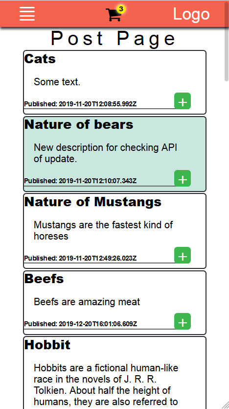
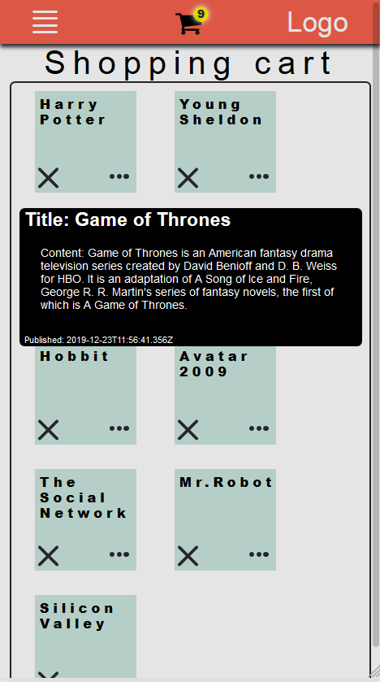
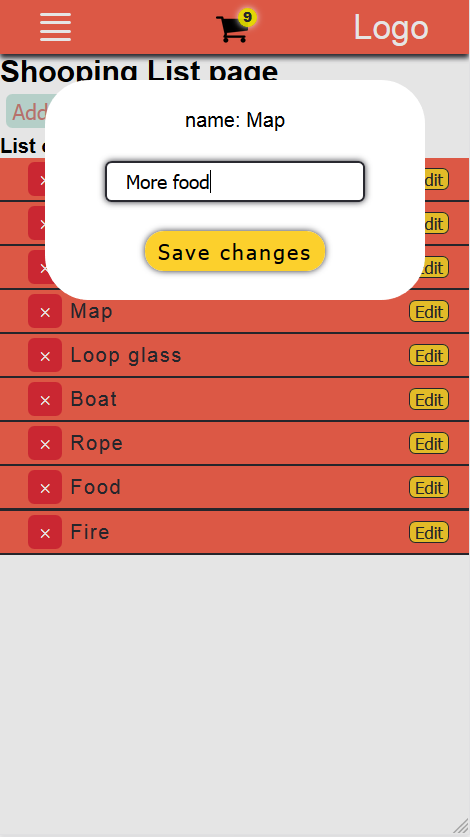

# The MERN Stack project

This is a little todolist project wich includes such kind of used tool as React, Redux, NodeJs(express), MongoDb.

## Getting Started

'''html

<pre>git clone https://github.com/ODanyor/MERN_Project.git</pre>
<pre>npm install</pre>
<pre>npm run dev</pre>

'''

## Built With

- React
- Redux
- NodeJS
  - Express
- MongoDb

## Screenshots

